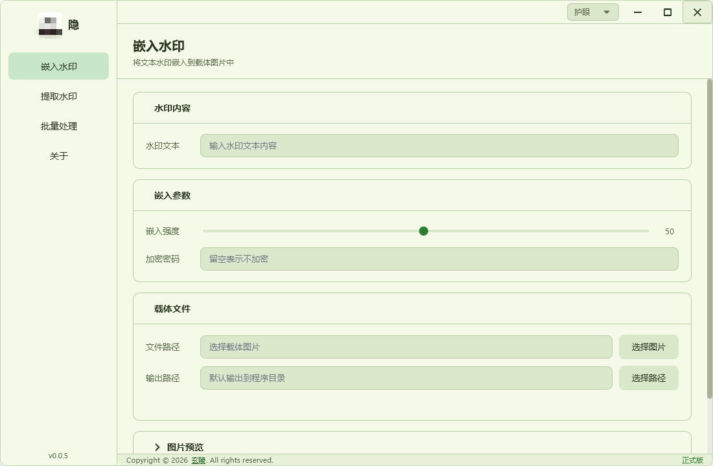
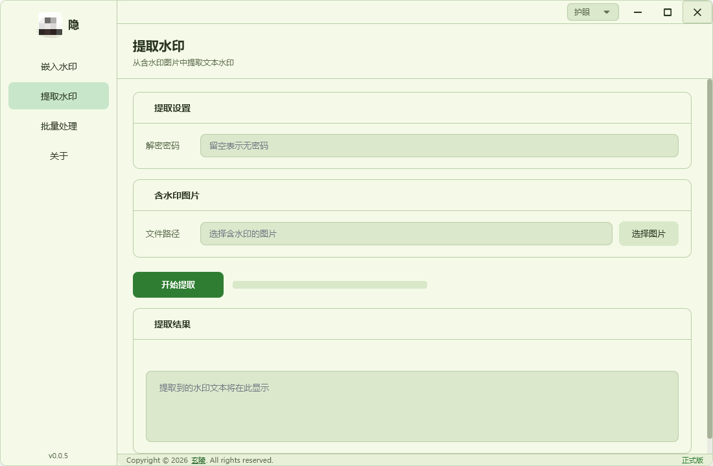
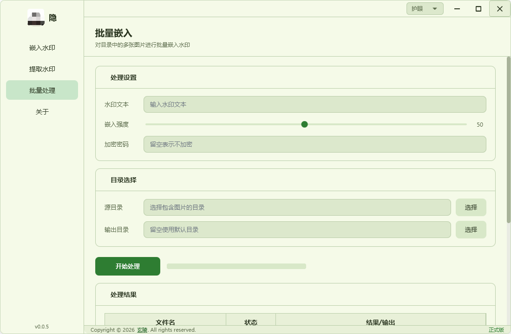
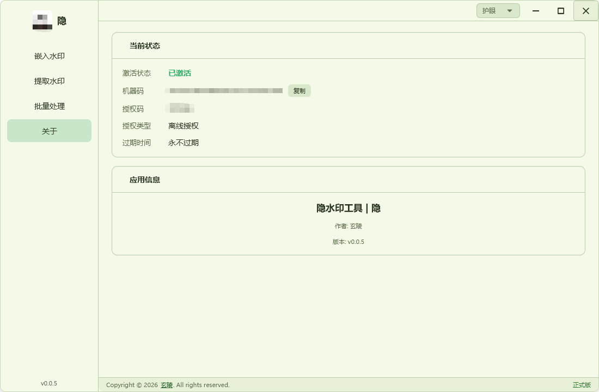
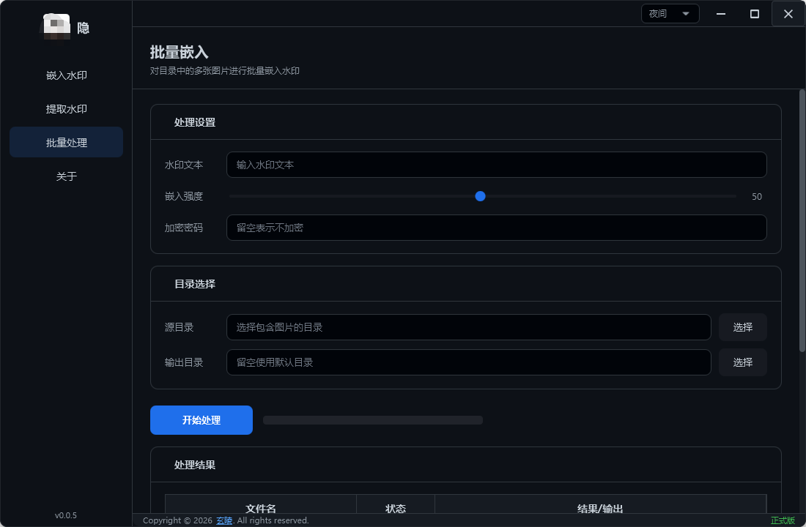
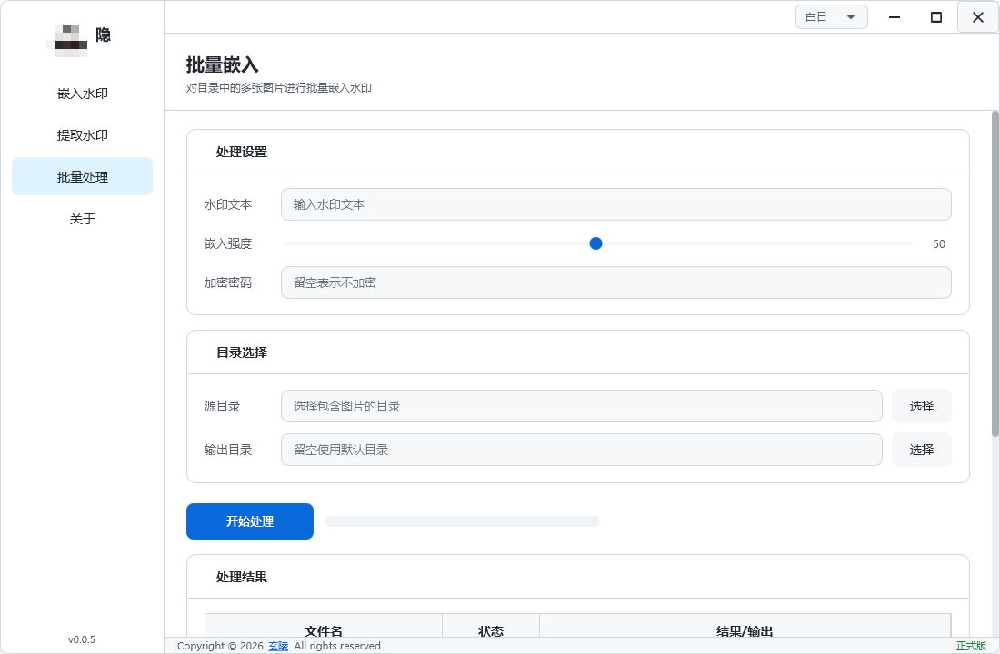
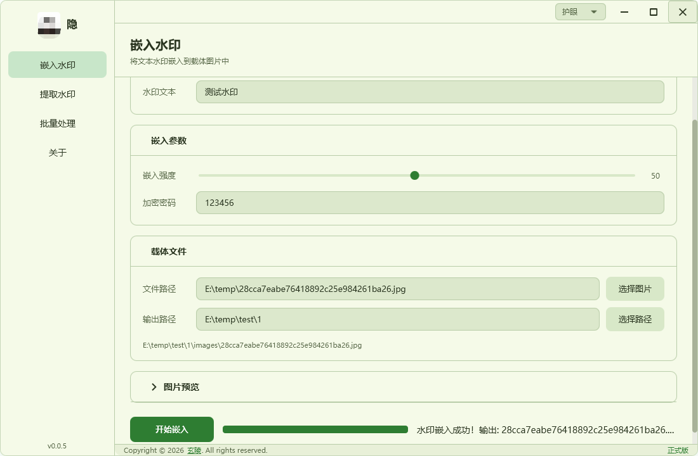
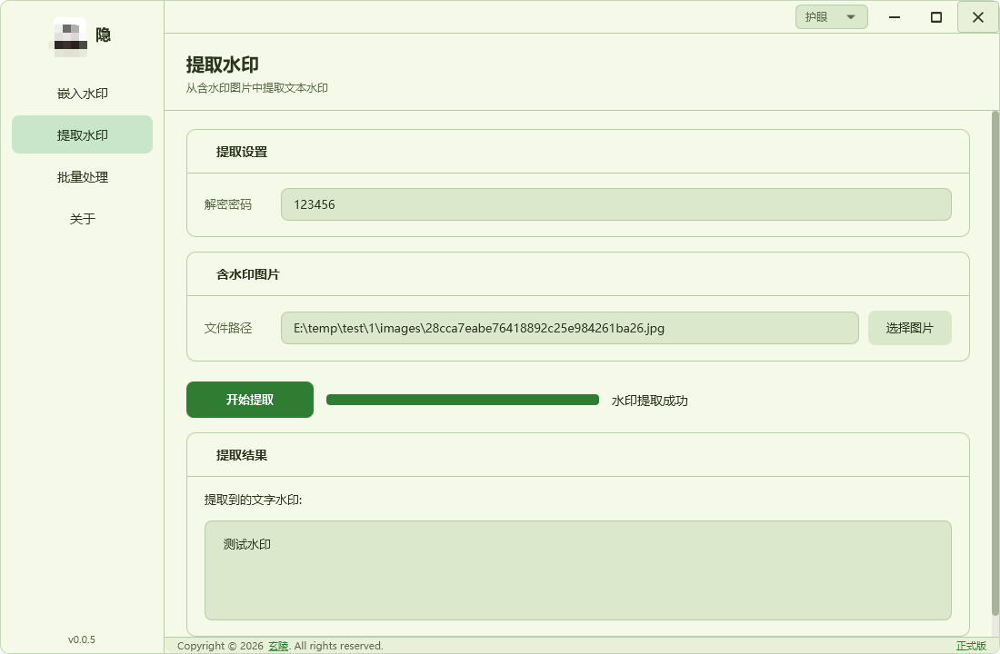

# BlindWatermarkGuard

基于 **DCT 频域变换** 的盲水印嵌入与提取桌面工具，用于图片/视频版权保护与维权取证。

> **盲水印**：水印信息不可见、不影响原图视觉效果，但可通过算法从被传播的图片中精确提取原始水印文本。

---

## 应用简介

BlindWatermarkGuard 是一款面向创作者的图片版权保护工具。你可以将一段文字（如版权标识、用户ID、时间戳等）以不可见的方式嵌入到图片中。当作品被未经授权传播时，只需用本工具对可疑图片进行水印提取，即可证明作品归属、追踪泄露源头。

核心技术基于 **DCT（离散余弦变换）频域水印算法**，通过相对系数比较法 + 冗余表决机制，在保证水印不可见性的同时，具备较强的抗压缩、抗裁剪能力。

## 效果展示

<div align="center">
  
  
  <br/><br/>
  
  
  <br/><br/>
  
  
  <br/><br/>
  
  
</div>

---

## 功能特性

### 水印处理

- **文字水印嵌入** — 将任意文字信息（最长200字符）不可见地嵌入图片
- **水印提取** — 从含水印图片中精准提取原始文字信息
- **密码保护** — 支持为水印设置密码（最长64字符），只有持有正确密码才能提取
- **强度可调** — 1~100 滑块调节嵌入强度，平衡不可见性与鲁棒性
- **图片预览** — 嵌入前可实时预览载体图片
- **自定义输出目录** — 可选择水印图片的保存位置

### 批量处理

- **批量嵌入** — 选择整个文件夹，一键为所有图片嵌入相同水印
- **智能并发** — 根据系统内存自动计算最优并发线程数
- **实时进度** — 表格展示每个文件的处理状态、耗时与结果
- **汇总统计** — 显示总计/成功/失败数量与总耗时

### 视频水印

- **视频水印嵌入/提取** — 支持 MP4 格式（需系统安装 ffmpeg）
- **逐帧处理** — 自动拆帧 → 逐帧嵌入 → 重新编码

### 授权管理

- **在线激活** — 输入授权码，联网验证后完成激活
- **离线激活** — 适用于无网络环境，通过机器码 + 授权码完成绑定
- **授权服务器** — 配套 Web 管理后台，管理授权码的生成、分配、启禁用
- **管理后台** — 基于 Vue 3 + Element Plus 的可视化管理面板

### 用户体验

- **四套主题** — 白日 / 夜间 / 护眼 / 汇崽（樱花粉+天空蓝渐变），顶部栏一键切换
- **无边框窗口** — 自定义标题栏，支持最小化、最大化、拖拽
- **自定义弹窗** — 统一风格的信息/警告/错误提示弹窗
- **菜单导航** — 左侧边栏 + 页面切换动画

---

## 技术架构

```
blind-watermark/
├── src/main/java/
│   └── com.blindwatermark/
│       ├── BlindWatermarkGuardApp.java    # JavaFX 启动入口
│       ├── Launcher.java                  # jpackage 启动器
│       ├── config/AppProperties.java      # 配置属性
│       ├── controller/                    # UI 控制器
│       │   ├── MainController.java        # 主窗口（导航/主题/窗口管理）
│       │   ├── EmbedController.java       # 嵌入水印页面
│       │   ├── ExtractController.java     # 提取水印页面
│       │   ├── BatchController.java       # 批量处理页面
│       │   ├── ActivationController.java  # 激活管理页面
│       │   └── CustomDialog.java          # 自定义弹窗
│       ├── service/                       # 业务逻辑
│       │   ├── BlindWatermarkService.java # DCT 水印核心算法
│       │   ├── BatchWatermarkService.java # 批量处理引擎
│       │   ├── VideoService.java          # 视频水印（ffmpeg）
│       │   ├── FileService.java           # 文件读写与格式处理
│       │   └── ActivationService.java     # 激活验证逻辑
│       └── util/
│           └── MachineCodeUtil.java       # 机器码生成
└── src/main/resources/
    ├── fxml/                              # 界面布局文件
    ├── css/                               # 主题样式（4 套）
    ├── icons/                             # 应用图标
    └── application.yml                    # 应用配置
```

### 技术栈

| 层级 | 技术 |
|------|------|
| 语言 | Java 21 |
| 桌面框架 | JavaFX 21.0.2 |
| 后端框架 | Spring Boot 3.5 |
| UI 主题库 | AtlantaFX 2.0.0 (PrimerLight / PrimerDark) |
| 水印算法 | 自研 DCT 频域盲水印（相对系数比较 + 冗余表决） |
| 工具库 | Hutool 5.8 / Lombok / Jackson |
| 日志 | Logback + SLF4J |
| 授权服务器 | Spring Boot + MyBatis-Plus + SQLite |
| 管理后台 | Vue 3 + Element Plus |
| 视频处理 | ffmpeg（外部依赖） |
| 构建打包 | Maven + jpackage（MSI 安装包） |

---

## 快速开始

### 环境要求

- **JDK 21** 或更高版本
- **Maven 3.8+**（用于编译构建）
- **ffmpeg**（可选，仅视频水印功能需要）

### 方式一：安装包

从 `app/release/installer/` 目录获取 MSI 安装包，双击运行即可安装。

---

## 使用教程

### 一、嵌入水印

1. 启动应用，点击左侧菜单 **「嵌入水印」**
2. **填写水印文本**：输入你想嵌入的文字信息（如版权标识、用户ID等）
3. **设置密码**（可选）：为水印加密，增强安全性
4. **调节强度**：通过滑块设置嵌入强度（默认50），数值越大水印越稳健，但可能略微影响画质
5. **选择载体图片**：点击「选择文件」按钮，选择需要保护的图片（支持 JPG/PNG）
6. **选择输出目录**（可选）：可自定义水印图片保存位置
7. 点击 **「嵌入水印」** 按钮，等待处理完成

> **提示**：试用模式下，图片尺寸不能超过 1920px，激活后无限制。

### 二、提取水印

1. 点击左侧菜单 **「提取水印」**
2. **选择含水印的图片**：选择可能包含水印的图片
3. **输入密码**：如果嵌入时设置了密码，提取时必须输入相同密码
4. 点击 **「提取水印」** 按钮
5. 提取成功后，水印文本将显示在结果区域

> **注意**：请使用嵌入时完全相同的密码，否则将无法正确提取。

### 三、批量处理

1. 点击左侧菜单 **「批量处理」**
2. **选择源文件目录**：包含待处理图片的文件夹
3. **填写水印文本**和**密码**（同嵌入水印）
4. **调节强度**（可选）
5. 点击 **「开始处理」**
6. 表格将实时显示每个文件的处理状态，完成后显示汇总信息

> **注意**：批量处理功能需要激活软件后使用。

### 四、软件激活

#### 在线激活

1. 点击左侧菜单 **「激活管理」**，查看机器码
2. 将机器码发送给管理员，获取授权码
3. 在「在线激活」区域输入授权码，点击「激活」

#### 离线激活

1. 复制本机机器码
2. 将机器码发送给管理员，管理员绑定后返回授权码
3. 在「离线激活」区域输入授权码，点击「激活」

#### 获取机器码

在激活管理页面顶部，可以查看并复制当前设备的机器码。每台设备的机器码唯一。

### 五、切换主题

在顶部标题栏右侧（最小化按钮左侧），可通过下拉菜单切换四种主题：

| 主题 | 说明 |
|------|------|
| 白日 | 默认浅色主题 |
| 夜间 | 深色暗黑主题 |
| 护眼 | 淡绿色护眼主题 |

---

## 算法原理

本工具的水印算法基于 **DCT（离散余弦变换）频域方法**，核心设计如下：

1. **8x8 分块 DCT** — 将图像划分为 8x8 像素块，对每块进行二维 DCT 变换
2. **中频系数对编码** — 每块选取 3 对中频 DCT 系数，每对编码 1 个比特
3. **相对系数比较** — bit=1 时 coeff_A > coeff_B + gap，bit=0 时相反；不依赖绝对值，抗压缩偏移
4. **冗余表决** — 每个比特重复嵌入 11 个连续块，提取时多数表决，容忍少量干扰
5. **XOR 密码置乱** — 基于 SHA-256 的伪随机 XOR 置乱（自逆运算，加密=解密）
6. **CRC-8 校验** — 提取后校验数据完整性，确保结果正确

---

## 试用与授权

| 功能 | 试用模式 | 已激活 |
|------|----------|--------|
| 文字水印嵌入/提取 | 支持（图片 ≤ 1920px） | 无限制 |
| 密码保护 | 支持 | 支持 |
| 批量处理 | 不支持 | 支持 |
| 视频水印 | 不支持 | 支持 |

---

## 致谢

- [AtlantaFX](https://github.com/mkpaz/atlantafx) — JavaFX 现代 UI 主题库
- [Hutool](https://github.com/dromara/hutool) — Java 工具库
- [Element Plus](https://github.com/element-plus/element-plus) — Vue 3 组件库（管理后台）

---

## 许可证

Copyright © 2026 玄陵. All rights reserved.
